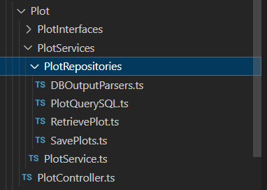
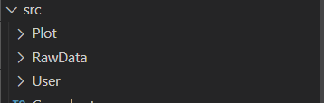
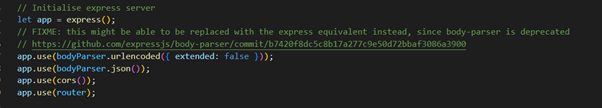
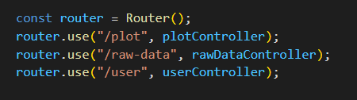
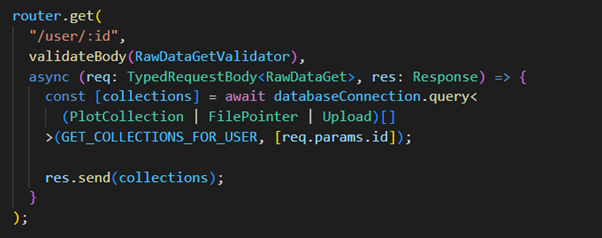
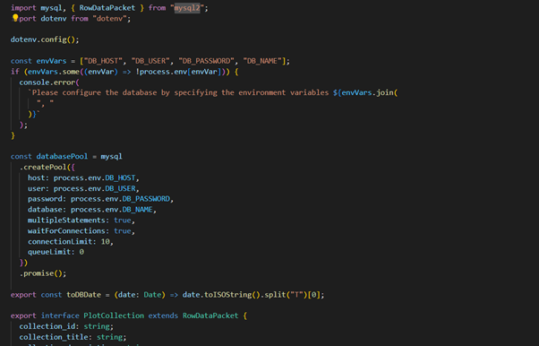
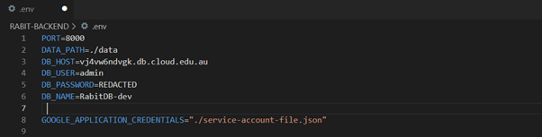

# Backend

## Overview

As we are using a controller-service-repository architecture, the backend has its functions modularised into these concepts.

Example of the file hierarchy Controller -> Service -> Repositories:

Sets of controller/service/repository files for different business logic functionalities have been separated into their own directories. This is to keep the code self-contained, and maintainable. The directories can be seen below:

Plot – Focuses on the business logic for plotting and visualising data.

RawData – Focuses on the business logic for receiving and processing user uploaded files.

User – Focuses on user related business logic, (i.e login, signup).

## Controller-Service-Repository

The controller will contain the REST API definitions and then apply the outcome of those to a service function. The REST APIs are created using the “express” ts library, which is initialised in the index.ts and router.ts files.

Index file:

 

Router.ts:

 

Example of creating REST API with express

More on express can be found at: https://expressjs.com/ 

The service function implements the business logic and functionality and then applys the outcome of those to the repository logic if needed.

The repository manages communications to the database with SQL queries. The SQL queries are managed using the “mysql12” library which is initialised in the databaseConnections.ts file. The connection details that are used to initialise the library can be found in the .env file.

databaseConnections.ts file:

 

.env file with password redacted:

