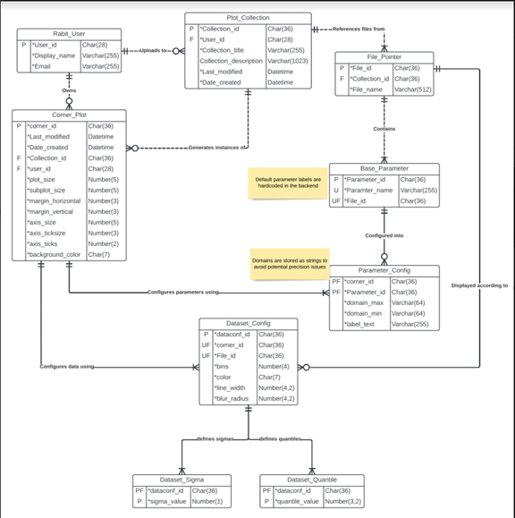

# Database

The architecture for the database can be seen in the following
UML diagram:

The Plot_Collection, File_Pointer and Base_Parameter tables
are populated when a user uploads files.

* The File_Pointer table -  Associates the files with their collections.
  It also associates the file name with its file_id.
* The Base_Parameter table -  Associates the Parameter_id’s with their
  file_id’s. The Parameter_id is a unique identifier for a parameter within a
  file. It is also used to identify the chunks of a file after it has the ‘process’
  api called on it.

* The Plot_Collection table - Associates collections with
  users, also various data on the collection itself.

The Rabit_User table – Used to stored information on each
user.

The remaining tables, i.e: Corner_Plot, Dataset_Config,
Parameter_Config, Dataset_Sigma, and Dataset_Quantile, are populated when a
user shares a visualised plot. This means that data on a visualised plot is not
stored unless it is shared.
