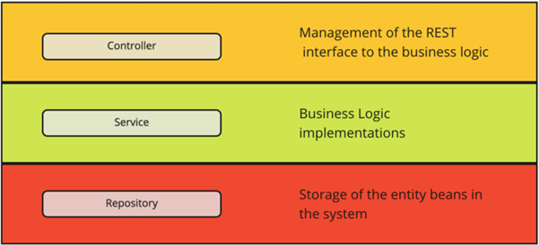

# System Architecture

## Controller-Service-Repository

The architecture for this project follows a controller-service-repository pattern which provides strong separation between the business logic, and database logic. This allows each component of the frontend and backend to be self-contained, have reduced coupling, and increased extendability.

This is implemented by the backend providing REST APIs for the frontend in the controller layer. These APIs use business logic and functionality from the service layer, which manage the data in the database with the repository layer. The separation of the logics are described in the following diagram:

Source: [https://tom-collings.medium.com/controller-service-repository-16e29a4684e5](https://tom-collings.medium.com/controller-service-repository-16e29a4684e5)

## Example

The following example shows how each of the components communicate with each other in this architecture. This example will show how the system processes files uploaded by a user:

So, the frontend:

-  Allows the user to upload files on the UI.

- Splits up the files into fixed sized chunks.
- Uses a REST API to tell the backend how many files it will send.

The backed:

- Receives that number and sends over the same number of file ids, using controller and service layer logic.

The frontend:

- Uses these file ids to associate each chunk with their file, and sends the chunk to the backend using a REST API.
- Calls the ‘process’ REST API

The backend:

- The backend stores the chunks in a directory on the server.
- Recieves ‘process’ api call on the controller layer and performs business logic on the service layer. The ‘process’ logic goes through the file and re-formats the chunks so that each variable within the file has its own chunk, this is to allow the variables to be accessed quickly. The service layer then uses the repository layer logic to send a SQL request to the database.

The database:

- Processes the SQL query and stores the file chunks within the database.

After the chunks are stored in the database they can easily be accessed by other logic to visualise the data.
