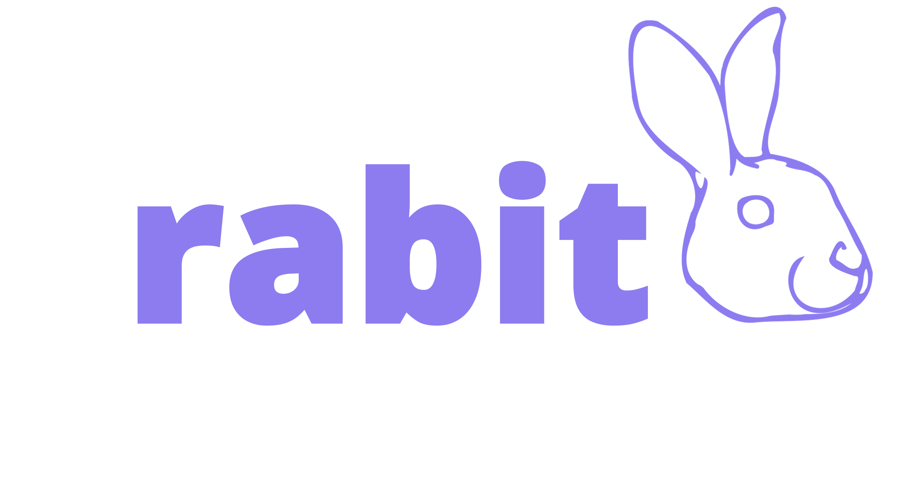

# RABIT

<!-- markdownlint-disable MD033 -->

  

<!-- markdownlint-restore -->

**R**obust **A**nalytical **B**ayesian **I**nference **T**ool

## What is RABIT?

RABIT is a data visualisation tool leveraging Bayesian Parameter Estimation in the context of Gravitational Wave Astrophysics.

## Try it out

<https://rabit2022.cloud.edu.au/plots>

## Features

### Modern web-based interface

RABIT is designed to be fast, beautiful and flexible, leveraging the latest web technologies such as [React](https://reactjs.org/) and [D3](https://d3js.org/).

### Easy to use

No need to install complicated programs or libraries, or spend hours writing scripts to visualise your data. Just upload your results file, and pick the parameters you want to show. All you need is a (reasonably modern) web browser, and you're set.

### Share your graph easily

You can export your plot to SVG and PNG and embed it to your report, or [generate a shareable link](./user-guide/view-plot.md#9-generate-a-shareable-url-for-the-plot) so everyone can see your plot easily, with all the parameters and view settings set.

### Free and open source

We believe that tools like RABIT should be accessible and extensible by anyone for any purpose. All the source code is available on [GitHub](https://github.com/FIT3170-FY-Project-7/RABIT-COMMON) under [ISC license](https://github.com/FIT3170-FY-Project-7/RABIT-COMMON/blob/main/LICENSE.md) for you to look and tinker around with. You can [run your own instance](./admin-guide/running-your-own-instance.md) if you really want to!

Got any issue, ideas, or even patches you want to share with us? Head over to our [contributing guide](./dev-guide/contributing.md) to help us improve RABIT.
