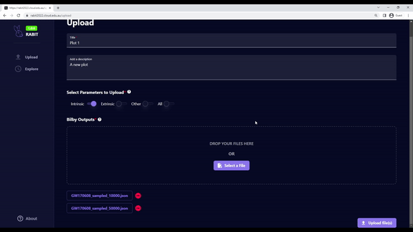

# Creating a plot

One of RABIT's premier features is the creation of Bayesian inference plots.

## 1. Navigate to the upload page

Navigate via the sidebar or go directly to the '/upload' URL. On the upload page, users will be able to create a plot by filling out the mandatory fields.

## 2. Add a plot title and description

A title for the plot must be added. An optional description can also be created.

## 3. Parameter selection

At least one class of parameters must be selected for upload. The current parameter options are 'intrinsic', 'extrinsic' and 'other'. To upload all three of these parameter classes, a user can select 'all'.

Specific parameters can be viewed by clicking the small question mark widget

## 4. Select raw JSON data files

Drag and drop or select a data file from its desktop directory.

The system currently supports a maximum of four files. All data must be in the accepted JSON file format.

The accepted file format can be viewed by clicking the small question mark widget

## 5. Upload the plot

Once the above fields are completed the plot can be created by clicking the upload
button.

