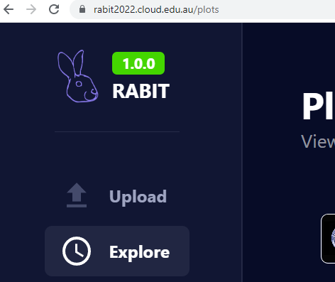
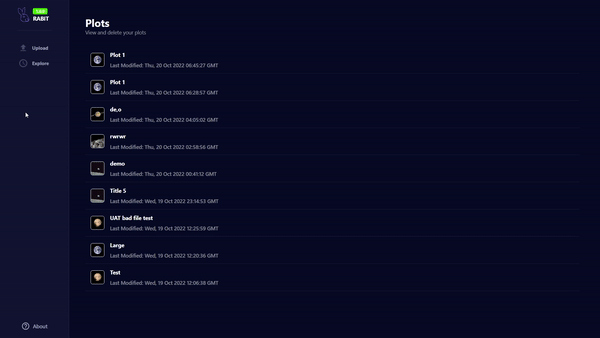
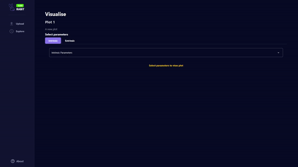
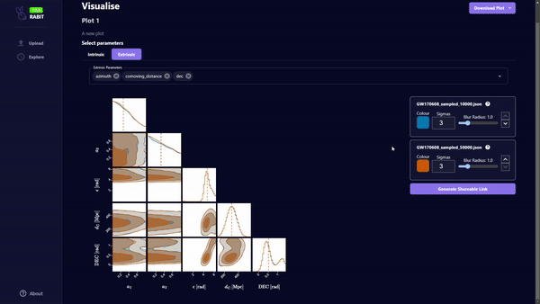
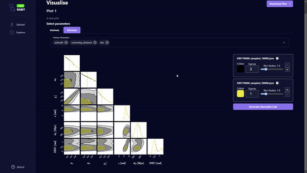
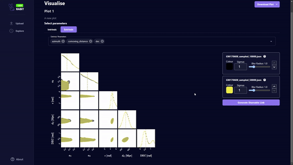
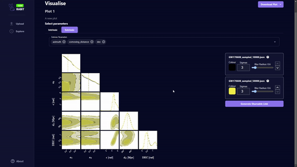
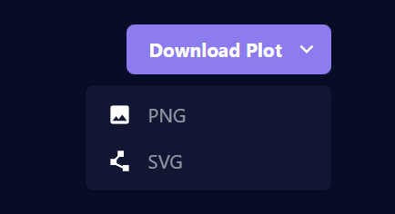

# Viewing a plot

One of RABIT's premier features is viewing Bayesian inference plots. For a plot to be viewed, it must first be created. If you haven't already done so, read the plot creation guide [here](https://github.com/FIT3170-FY-Project-7/RABIT-DOCS/blob/main/src/user-guide/create-plot.md).

## 1. Navigate to the plots page

Navigate to 'Explore' from the sidebar, or go directly to the `/plots` URL.

## 2. Select a plot to view

Select which plot to view from the plots list

## 3. Parameter selection

From each class of parameter that was uploaded, select the specific parameters to plot

## 4. Modify the colour of the plots

Plot colours can be modified by selecting the colour box. Use contrasting colours for multi-set plots to enhance readability.

## 5. Reordering multi-dataset plots

Change the order of the plots using the arrow button. Lower order datasets will be displayed on top of higher order datasets.

## 6. Adjust plot sigma value

The plot sigma represents the number of deviations from the mean. Increasing this value will increase the spread of the plot. This value is set to 3 by default.

## 7. Adjust plot blur radius

The blur radius can be increased to filter noise from the data. This value is set to 1.0 by default.

## 8. Save plot as an image
Plots can be saved locally in PNG or SVG format.

## 9. Generate a shareable URL for the plot
Create a shareable link for a plot. From the viewers perspective, the shared plot cannot be modified, but can be downloaded.

